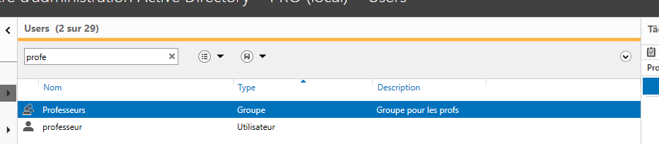
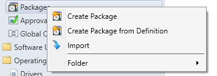
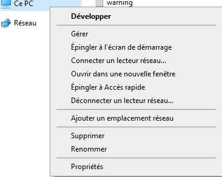
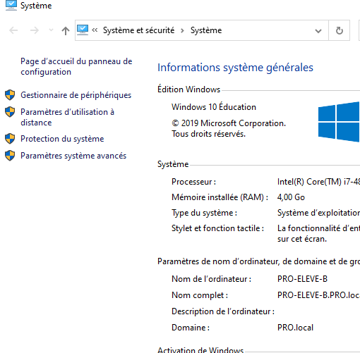

# Guide d'installation

##### Nom : Management de Session Windows

##### Contexte : Cours de PRO - HEIG-VD 2020

##### Professeur responsable : Jean-Marc Bost

##### Équipe de développement :

| Nom                               | E-mail                                                       | Github       |
| --------------------------------- | ------------------------------------------------------------ | ------------ |
| Cassandre Wojciechowski           | [cassandre.wojciechowski@heig-vd.ch](mailto:cassandre.wojciechowski@heig-vd.ch) | CassandreWoj |
| Gabriel Roch (Project lead)       | [gabriel.roch@heig-vd.ch](mailto:gabriel.roch@heig-vd.ch)    | g-roch       |
| Gwendoline Dossegger              | [gwendoline.dossegger@heig-vd.ch](mailto:gwendoline.dossegger@heig-vd.ch) | Dosseggegw1  |
| Laurent Scherer                   | [laurent.scherer@heig-vd.ch](mailto:laurent.scherer@heig-vd.ch) | 0x47726579   |
| Laurent Thoeny                    | [laurent.thoeny@heig-vd.ch](mailto:laurent.thoeny@heig-vd.ch) | Sicriss      |
| Nenad Rajic (deputy project lead) | [nenad.rajic@heig-vd.ch](mailto:nenad.rajic@heig-vd.ch)      | NR09         |

----


### Support technique

En cas de problème rencontré lors de l'installation, l'équipe peut être contactée par plusieurs moyens :

- par e-mail (cités ci-dessus)
- sur le canal A-07 de l'équipe PRO sur Microsoft Teams
- sur le groupe Telegram **PRO Support A-07** dédié accessible via le lien d'invitation (trouvable également sur la page Github "HEIGVD-PRO-A-07-Documentation") : 
  - https://t.me/joinchat/AcsX7Bzt3UJ9Oc4PGYfQIQ

Le délai de réponse sera plus rapide via Telegram.


----

### Dépendances

Avant de procéder à l'installation, il est nécessaire de s'assurer que les dépendances ci-dessous sont respectées :

* Active Directory

* Deux groupes : Professeurs et Eleves, membres du domaine. 




* Les ordinateurs sur lesquels l'application sera installée appartiennent au domaine (dans le cadre de PRO toutes les VMs sont déjà configurées pour).


### Prérequis 

##### Infrastructure

- Les machines utilisant cette application doivent être dans le même réseau (serveur compris) 

- Un DNS doit être sur le même réseau que les machines

- Le port 7777 doit être libre afin d'être utilisé pour l'application de surveillance

  

##### Pare-feu

- Il faut autoriser les paquets entrants sur le port 7777 des machines


##### Active Directory

Pour l'utilisation de cette application, l'infrastructure nécessite d'avoir le service Active Directory de Windows qui contient les groupes ci-dessous avec leurs utilisateurs:

- Groupe **Professeurs **
- Groupe **Eleves**


### Installation

##### Téléchargement

L'exécutable est disponible à l'adresse suivante :

​           client : [télécharger ici](lien_bla_bla) **TODO adresse correcte**

​           serveur : [télécharger ici](lien_bla_bla) **TODO adresse correcte**

Pour vérifier la version de l'exécutable, voici le hash sha256 de celui-ci : 

​           Hash client : **TODO hash last version**

​           Hash serveur : **TODO hash last version**

1) Pour récupérer le hash : ``Get-FileHash .\PRO.exe -Algorithm SHA256 | Format-List``

2) Pour comparer le hash : ``"HASH1" -eq "HASH2"``


##### Configuration des SID des groupes (élèves/professeur) :

Les groupes sont actuellement configurés dans le code, ils vont en être sortis. Si besoin est de les modifier, il faut pour l'instant effectuer les changements dans le code.
Dans le cas où les noms des groupes AD utilisés diffèrent de ceux pensés à la base, il est possible de les modifiers dans le fichier `Protocol.cs`.
Il faudra remplacer les deux lignes : 

```c#
protected const string STUDENT_GROUP_SID = "S-1-5-21-2171971402-2391369406-1675826876-1105";
protected const string PROFESSOR_GROUP_SID = "S-1-5-21-2171971402-2391369406-1675826876-1106";
```

par les SID souhaités.


#### Utiliser Configuration Manager


La meilleure solution serait d'utiliser SCCM, maintenant le [gestionnaire de logiciels Windows](https://docs.microsoft.com/en-us/mem/configmgr/core/understand/what-happened-to-sccm), qui permet de créer des *packages* avec différentes options.



Les différentes options pour lancer les programmes sont décrites par la suite.

`configmgr` est la solution optimale du fait qu'il permet aux administrateurs de spécifier quel programme lancer, via le chemin vers l'exécutable sur une machine, ainsi que les arguments que l'on veut donner à cet exécutable (voir la suite de la documentation pour les arguments relatifs aux différentes machines).
Il permet aussi de gérer la condition de lancement d'une application (typiquement lors de la connexion d'un utilisateur) et les droits avec lesquels une application se lance.


##### Configuration des lancements de l'application selon le type de poste : 

Notre application différenciera deux types de postes : client (professeur|élève) et serveur (AD).
Le lancement de l'application se fait à l'aide de la commande suivante et à l'emplacement où se situe l'exécutable. Le port considéré par défaut est le ``7777``.

- pour les clients : ``.\PRO.exe [professeur|eleve] <ipServer> <Port>``

- pour le serveur : ``.\PRO.exe serveur <Port>``


###### Serveur

L'application côté serveur sera considérée comme un service, i.e. elle démarrera avec le serveur et restera active avec le serveur.

Les arguments nécessaires au bon fonctionnement de l'application sont par défaut :  ``.\PRO.exe serveur``
Un port pourra être spécifié de cette façon : ``.\PRO.exe server 7777``
À noter que le port par défaut est le ``7777``.

Dans le cadre de PRO, les arguments par défaut seront suffisant.


###### Client - élève

Pour le bon fonctionnement de l'application côté élève, il est nécessaire de la lancer avec des droits administrateur local au minimum, l'application ayant besoin d'interagir avec `kernell32.dll`.
L'application sur un poste élève devra être démarrée pour chaque nouvelle session de la part d'un élève.
Pour cela il serait préférable d'utiliser `SSCM`/`configmgr` qui permet d'effectuer toutes ces actions, ainsi que de les automatiser. [Voir la documentation MS](https://docs.microsoft.com/en-us/mem/configmgr/core/clients/deploy/plan/client-installation-methods)

Les arguments nécessaires au bon fonctionnement de l'application sont par défaut : ``.\PRO.exe eleve 192.168.0.1`` ou ``.\PRO.exe eleve pro.local``.
L'IP fournie en 2ème argument sera celle du serveur AD sur lequel l'application est active. 


###### Client - professeur 

Pour les sessions "professeur" la différence majeure sera la nécessité de créer un raccourci vers l'application sur le bureau, qui lancera l'application avec la commande : ``.\PRO.exe professeur 192.168.0.1 `` par défaut.

 ``.\PRO.exe professeur 192.168.0.1 7777``


### Tester l'application

Trois machines virtuelles composées d'un serveur Windows et de deux clients Windows sont disponibles à l'adresse suivante : [lien pour télécharger]() **A_METTRE_LE_BON_LIEN**. L'ensemble de l'infrastructure est fonctionnel pour réaliser l'installation décrite ci-dessus. 


Pour lancer l'application, veuillez suivre les étapes suivantes :

1. Démarrer le serveur
2. Générer les utilisateurs dans l'Active Directory depuis le script fourni en annexe
3. Démarrer un client et y connecter un professeur
4. Démarrer un client et y connecter un élève
5. Exécuter l'application sur la machine du professeur depuis le raccourci bureau


Pour activer la connexion à distance sur un poste, il faut : 

1. Dans l'explorateur de fichier, clic droit sur "Ce PC" et sélectionner "Propriétés"

   

2. Sélectionner "Paramètres d'utilisation à distance"

   

3. Cocher "Autoriser les connexions à distance à cet ordinateur"

   


Pour tester l'application, il faudra suivre les étapes suivantes : 

1. Depuis le GUI de l'application (sur la machine professeur), choisir un groupe d'élèves à surveiller
2. Depuis la machine élève, effectuer des actions diverses (cela permet de visualiser des changements au niveau de la surveillance dans le GUI)
3. Essayer les différentes fonctionnalités proposées par l'application (boutons du GUI) 


Pour des tests plus complets, nous avons établi une liste de contrôles (grille des tests disponible en annexe). En cas d'hésitation sur l'utilisation du GUI, veuillez-vous référer au manuel d'utilisation [ici]( https://github.com/HEIGVD-PRO-A-07/HEIGVD-PRO-A-07-Documentation/tree/master/manuelUtilisation ).


-----

### Annexes

- Script de génération d'utilisateurs/groupes pour l'AD ([accès au script]( https://github.com/HEIGVD-PRO-A-07/HEIGVD-PRO-A-07-Documentation/blob/master/manuelInstallation/script_AD.ps)) 

  Ce script est destiné à être lancé depuis le bureau. Il génère les utilisateurs présents dans le [fichier csv]().  
  
- Grille des tests des fonctionnalités et leurs critères de validation [télécharger ici]( https://github.com/HEIGVD-PRO-A-07/HEIGVD-PRO-A-07-Documentation/tree/master/rapport/RapportDeControle ) **METTRE_A_JOUR_LIEN**

