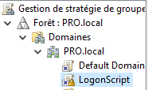
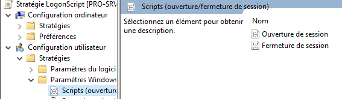
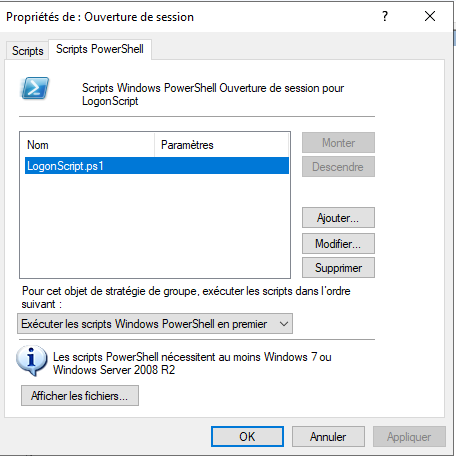
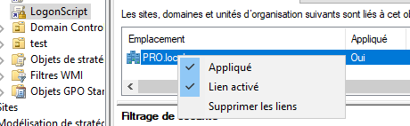

# Script de logon

##### Nom : Management de Session Windows

##### Contexte : Cours de PRO - HEIG-VD 2020

##### Professeur responsable : Jean-Marc Bost

##### Équipe de développement :

| Nom                               | E-mail                                                       | Github       |
| --------------------------------- | ------------------------------------------------------------ | ------------ |
| Cassandre Wojciechowski           | [cassandre.wojciechowski@heig-vd.ch](mailto:cassandre.wojciechowski@heig-vd.ch) | CassandreWoj |
| Gabriel Roch (Project lead)       | [gabriel.roch@heig-vd.ch](mailto:gabriel.roch@heig-vd.ch)    | g-roch       |
| Gwendoline Dossegger              | [gwendoline.dossegger@heig-vd.ch](mailto:gwendoline.dossegger@heig-vd.ch) | Dosseggegw1  |
| Laurent Scherer                   | [laurent.scherer@heig-vd.ch](mailto:laurent.scherer@heig-vd.ch) | 0x47726579   |
| Laurent Thoeny                    | [laurent.thoeny@heig-vd.ch](mailto:laurent.thoeny@heig-vd.ch) | Sicriss      |
| Nenad Rajic (deputy project lead) | [nenad.rajic@heig-vd.ch](mailto:nenad.rajic@heig-vd.ch)      | NR09         |

### Création de la GPO

1. Depuis le serveur, aller dans: `Outils > Gestion de stratégies de groupe `

2. Créer un nouvel objet GPO dans le domaine PRO.local           

3. Modifier le nouvel objet créer:

   1. Aller dans : `Configuration utilisateur > Stratégies > Paramètres Windows > Scripts(ouverture/fermeture de session)`

      

   2. Aller dans : `Ouverture de session`

   3. Aller dans l'onglet  `Scripts PowerShell`

      1. Séléctionner `Exécuter les scripts PowerShell en premier`

      2. Cliquer sur `Afficher les fichiers...`

      3. **IMPORTANT** : Copier puis coller le script `LogonScript.ps1` dans le dossier ouvert puis fermer la fenêtre

      4. Cliquer sur `Ajouter`, puis tapper `LogonScript.ps1`  et ensuite valider en cliquant sur `Ok`

         

4. Appliquer la GPO en faisant un clique droit, puis `Apliqué`

   

   

### Création du dossier partagé

1. Créer un dossier sur le serveur : `c:\Shared_APP`
2. Partager le dossier en allant dans:'`Propriétés > Partage avancé...`
3. Cocher la case `Partager ce dossier`
4. Ajouter l'executable `PRO.exe` dans le dossier